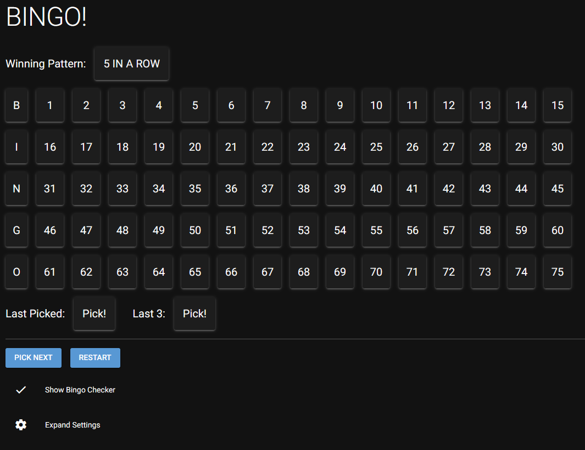
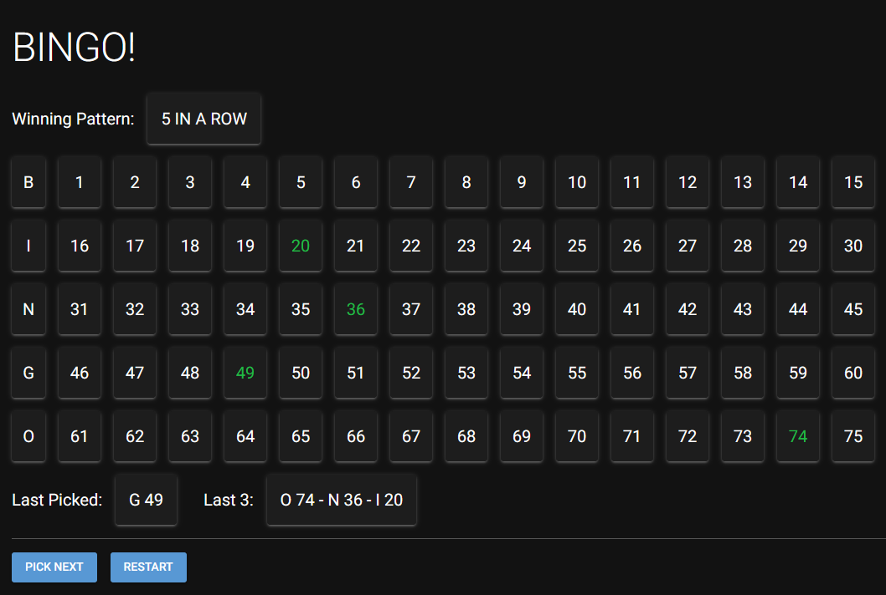
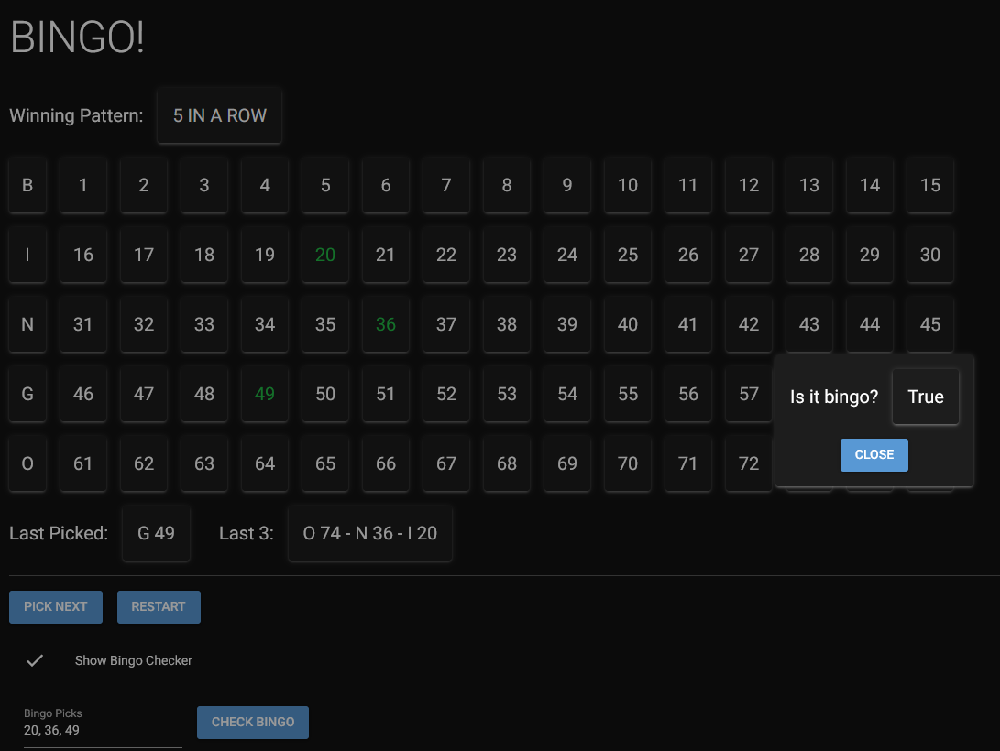
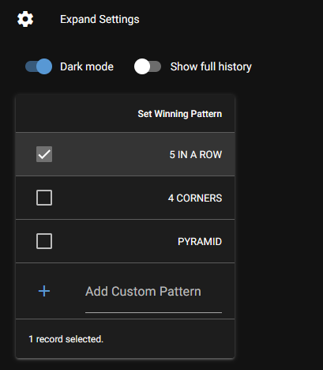

# BingoBoard

This is a basic implementation of a Bingo board tracker, intended to be used with Bingo cards.

## Features
- Live update of history
- Settings to change the winning pattern, or add a custom pattern
- Bingo Checker that takes a list of comma separated numbers and checks if they have been called
    - Allows bingos to be checked easily

## Usage
- Download the release exe (Windows) and run
    - packed using [nicegui-pack](https://nicegui.io/documentation/section_configuration_deployment#package_for_installation) (pyinstaller)
- OR clone the repo
    - `pip install -r requirements.txt`
    - `python3 BingoWeb.py`
    - if browser does not automatically open, navigate to the IP/port shown after running

## Requirements
- python3.8+
- nicegui

## Screenshots

